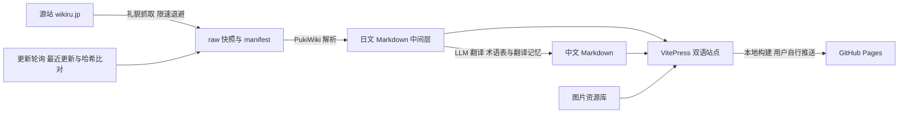

## User Requirements

用户希望将日文游戏攻略 WIKI《超昂大戦エスカレーションヒロインズ攻略 Wiki》（escalationheroines.wikiru.jp，PukiWiki 系统）镜像到本地，规范化存储原网页资源，并支持在原网页更新后重新下载与增量更新；在此基础上构建一个可在中日文之间切换的静态 WIKI 站，最终部署到 GitHub Pages。工作区现有的 index.html 与 img/ 只是一个简陋 demo，本项目按正式工程重构，图片资源迁移复用。

## 抓取范围（用户已明确，两阶段发现）

**第一阶段：观察列表页（约 40 个，需跟踪更新）**。先抓取 WIKI 主页面，解析左侧导航栏（MenuBar）超链接得到，明确清单：

- ゲームガイド：序盤の手引き、よくある質問、小ネタ・小ワザ集、ガチャ
- キャラクター：キャラクター一覧（含 SSR/SR/R、サポーター、NPC 分区）、必殺技一覧、固有効果一覧、特殊属性一覧、原画別索引、CV一覧、実装履歴
- システム：レイド（＋レイドおすすめキャラ、レイドバフ・デバフ別キャラ一覧、レイド用編成例）、Bユニバース（強敵戦）、広域戦（＋マップリスト）、殲滅戦、限界突破、覚醒強化、レベル上限UP、宝箱、交換所（＋キャラクター交換所）、コレクション、ショップ（VIPランク）
- 装備･アイテム：装備一覧（＋超昂装備）、アイテム一覧（＋[初心者用]アイテム価値早見表）
- クエスト･ミッション：メインストーリー（＋全シナリオ実装順）、メインクエスト、デイリークエスト、ミッション一覧、イベント一覧
- その他：用語集/俗語集、Tips一覧、ゲーム外企画、事前登録特典

**第二阶段：静态角色详情页（约 300~400 个，抓一次基本不更新）**。抓取「キャラクター一覧」后，解析其中 SSR | SR | R 三个分区的角色详情页链接得到具体清单与数量。

**评论页（コメント/ 前缀）需要抓取并翻译**：每个内容页对应的评论子页中可能有实用补充信息，作为独立分类随两阶段发现一并登记（mode 跟随其父页面）。

明确不抓取：掲示板各页、はじめに（wiki 使用指南）、編集者用ページ、寝室シーン一覧（R18）。注册表中保留显式开启的开关。

## Product Overview

项目由两部分组成：一条"抓取 → 快照 → 解析 → 翻译 → 生成"的数据流水线，以及一个中日双语静态 WIKI 站。流水线负责把源站约 400 个一次性页面（角色属性等，抓一次基本不变）和约 40 个需要持续跟踪更新的页面下载到本地，按统一规范存储原始快照、元信息、图片资源与解析结果；当源站页面更新时，能检测变更并只重新处理变化的页面。静态站以日文为源内容，中文由大模型结合日本游戏术语表翻译生成并支持人工校对覆盖，读者可在页面间一键切换语言。整体页面性能要好，适配 GitHub Pages 托管。

## Core Features

- 页面注册表：两阶段自动发现生成清单（主页面左侧导航链接 → 约 40 个观察页；キャラクター一覧 的 SSR/SR/R 分区链接 → 约 400 个角色详情静态页），区分"一次性静态页"与"观察列表页"，支持分类；コメント/ 评论页作为独立分类一并抓取与翻译；排除规则（掲示板、编辑者页、R18 页默认不抓，可显式开启）
- 礼貌抓取：可配置请求间隔与随机抖动、自定义 UA、被限流时自动等待 10 到 40 秒退避重试、失败断点续抓
- 规范化快照存储：原始 HTML 按页面统一命名存档，附 URL、抓取时间、内容哈希、源站最后修改时间等元信息；图片资源统一下载、按内容哈希命名、页面引用改写为本地路径
- 变更检测与增量更新：单个手动执行脚本（update 子命令，附 update.ps1 包装），轮询源站最近更新与观察列表，哈希比对后仅重抓、重解析、重翻变更内容；不做定时任务，由用户不定时手动运行
- 中日双语翻译：日文页面所有文本逐字忠实原网页，不纠错、不删减、不改写；中文由大模型结合术语表自动翻译，翻译记忆缓存避免重复翻译，人工校对文件可覆盖机翻结果
- 文本与页面解耦：任何文本都不硬编码在 HTML 中——界面文案存 i18n 字典文件（ja/zh），正文存双语 Markdown 文件对，角色属性等结构化数据存语言中立 JSON；HTML 只是构建产物，切换语言即切换文本源
- 双语静态 WIKI 站：首页门户、角色一览（稀有度与属性筛选、搜索、卡片网格，复刻并升级 demo 的筛选体验）、角色详情悬浮窗（悬停头像/名字即显完整属性，核心交互）、角色详情页、装备道具图鉴、攻略文章、更新记录等页面，日文与中文一键切换，明亮与暗黑双主题
- 全局搜索：顶部导航内置搜索框，索引覆盖所有子页面（含评论页），中文环境与日文环境均可检索
- 部署：构建产物为纯静态文件，按 GitHub Pages 项目站点配置 base 路径；不提供 CI 工作流，由用户自行提交分支发布

## Tech Stack

- 数据流水线：Python 3.11+，httpx（或 requests）+ BeautifulSoup4 与 lxml + PyYAML；LLM 翻译走 OpenAI 兼容 API（provider 可配置）
- 静态站点：VitePress（Vue 3 内核，静态 MPA 输出，内置 i18n 路由与 minisearch 全文搜索，可嵌自定义 Vue 组件）
- 部署：纯静态产物适配 GitHub Pages，用户自行推送发布

## Implementation Approach

### 总体策略

采用经典 ETL 分层：抓取层只负责"原样下载与存档"，解析层把 PukiWiki HTML 转成结构化日文 Markdown 中间层，翻译层基于中间层生成中文，站点层把双语 Markdown 渲染为静态站。层与层之间以文件为契约，任何一层可单独重跑，保证可追溯、可增量。

### 关于哈希路由的说明（回应用户关切）

不需要哈希路由。GitHub Pages 托管纯静态文件没有问题：VitePress 构建产物是 MPA，每个页面都是真实存在的独立 HTML 文件（如 /escah/ja/characters/xxx.html），语言切换只是指向真实文件的普通链接，不涉及 SPA 的前端路由跳转，因此不存在"域名跳转不支持"的问题。哈希路由是 SPA 单文件方案的妥协，本方案用不上，且 MPA 对 SEO 与首屏性能更有利。

### 关键技术决策

- 礼貌抓取与反封禁：默认请求间隔 2 到 4 秒加随机抖动，明显低于触发阈值；遇到 429 或 5xx 时按 10 秒、20 秒、40 秒指数退避，最多重试 3 轮后跳过并记录；manifest 记录每页 sha256 与抓取状态，中断后可断点续抓，已抓且哈希未变的页面绝不重复下载。全站 440 页预计单次全量抓取约 30 分钟，可接受
- 规范化存储：Windows 下日文页面名直接做文件名存在编码与路径长度风险，统一用页面名的 URL 编码或短哈希作为文件名，真实页面名存于注册表与 manifest；图片按内容哈希命名，天然去重
- 变更检测：每页计算正文 sha256；观察列表页（约 40 个）通过轮询源站"最近更新"页与逐页 Last-modified 比对触发重抓；一次性页（约 400 个）默认跳过，可用参数强制全量
- 翻译成本控制：按块（段落与表格行）切分，源文块哈希命中翻译记忆则直接复用，只有新增或变更的块才调用 LLM；glossary.yaml 中的术语在翻译前占位、翻译后强制替换，保证"必殺技"等游戏术语译法统一；overrides/zh 下的人工校对文件优先级最高，永不被机翻覆盖
- 性能：静态 MPA 输出、图片懒加载与构建期压缩、分类侧边栏按需生成；构建复杂度与页面数线性相关，440 页规模 VitePress 构建在分钟级
- 文本解耦三层分离：界面文案（i18n 字典 ja/zh）、正文（双语 Markdown 文件对）、结构化数据（语言中立 JSON，如角色属性）各自独立存放，构建时才合成为 HTML；修改任何文本只需动数据文件
- 日文忠实原则：解析器对日文正文逐字保留，禁止纠错、删减、润色；只做结构提取（标题层级、表格转 Markdown），文本内容与原网页完全一致
- 全局搜索：用 VitePress 内置 minisearch，按 ja 与 zh 两个 locale 分别建索引，导航栏搜索框在任何子页面可用
- 悬浮详情窗数据策略：角色数据按角色拆成独立 JSON 小文件（约 400 个），首次悬停时懒加载并内存缓存，之后悬停零网络请求；浮窗纯文本不加载图片

### 规避技术债

全流程只依赖文件系统约定，不引入数据库；解析器只针对 PukiWiki 一种模板，用 CSS 选择器白名单提取正文，避免过度通用化；流水线各阶段是独立子命令，失败可单页重跑。

## Implementation Notes

- 编码：全链路强制 UTF-8，Windows PowerShell 下注意子进程与文件读写显式指定编码
- 日志：流水线统一输出带级别的日志（抓取每页一行 INFO，重试 WARN，失败 ERROR 附页面名与原因），不记录翻译 API 密钥；日志写入 data/logs 便于排查
- 爆炸半径：demo 的 index.html 代码废弃、由 VitePress 站点整体取代（用户已许可删除，原文件移入 legacy/ 归档，git 历史可追溯）；img/ 下 738 张图片迁移进 data/assets 并尽量按哈希去重后复用，不删除原始文件；站点生成目录（site/ja、site/zh）由流水线产出，不手工编辑
- 合规：仅做游戏数据镜像与翻译，R18 分类页面默认排除，可在注册表中显式开启

## Architecture Design



## Directory Structure

```
escah/
├── pipeline/                          # [NEW] Python 数据流水线包
│   ├── pyproject.toml                 # 依赖与命令行入口声明
│   └── escah_pipeline/
│       ├── cli.py                     # 子命令入口：fetch、parse、translate、update、sync-site
│       ├── config.py                  # 全局配置：源站 base、限速参数、路径常量
│       ├── fetcher.py                 # 礼貌抓取器：间隔与抖动、UA、10/20/40 秒退避、断点续抓
│       ├── registry.py                # 页面注册表读写，static 与 watch 分类，排除规则
│       ├── snapshot.py                # 快照写入与 manifest 维护，sha256 变更检测
│       ├── parser_puki.py             # PukiWiki HTML 提取正文并转结构化日文 Markdown
│       ├── assets.py                  # 图片下载、内容哈希命名、页面引用本地化改写
│       ├── translator.py              # OpenAI 兼容 API 调用、术语占位与强制替换
│       ├── tm.py                      # 翻译记忆：源文块哈希到译文的持久缓存
│       └── glossary.py                # 术语表加载校验
├── data/
│   ├── registry/pages.yaml            # [NEW] 页面注册表：页面名、分类、static 或 watch、排除项
│   ├── raw/                           # [NEW] 原始 HTML 快照（编码文件名）
│   ├── manifest.json                  # [NEW] 每页 URL、抓取时间、sha256、Last-modified、状态
│   ├── parsed/ja/                     # [NEW] 解析后的日文 Markdown 中间层
│   ├── parsed/characters/             # [NEW] 语言中立角色结构化 JSON（悬浮窗数据源）
│   └── assets/img/                    # [NEW] 本地化图片（含迁移的 demo 图片，哈希去重）
├── glossary/glossary.yaml             # [NEW] 日到中游戏术语表
├── overrides/zh/                      # [NEW] 人工校对覆盖文件，优先级高于机翻
├── site/                              # [NEW] VitePress 站点
│   ├── package.json
│   ├── .vitepress/config.ts           # base 为 /escah/，locales 配置 ja 与 zh，minisearch
│   ├── .vitepress/theme/              # 自定义主题、i18n 界面字典（ja/zh）、筛选器与悬浮窗等 Vue 组件
│   ├── ja/ 与 zh/                     # 流水线生成的双语内容
│   └── public/                        # img/ 构建期从 data/assets 同步；data/ 存放角色 JSON 供悬浮窗懒加载
├── legacy/index.html                  # [MODIFY] demo 归档保留
├── img/                               # [MODIFY] 迁移至 data/assets 后删除或保留备份
└── README.md                          # [MODIFY] 重写：架构说明、命令用法、更新与部署流程
```

## Key Code Structures

```
# data/registry/pages.yaml 单页条目
- name: "キャラクター一覧"        # PukiWiki 页面名（抓取 URL 依据）
  slug: "character-list"         # 站点路由用英文 slug
  category: "character"          # 分类：character、equipment、quest、system、guide
  mode: "watch"                  # static（一次性）或 watch（跟踪更新）
```

```
// data/manifest.json 单页条目
{"name": "キャラクター一覧", "url": "https://escalationheroines.wikiru.jp/?...", "file": "raw/%E3%82%AD%E3%83%A3%E3%83%A9.html", "sha256": "…", "last_modified": "2026-07-22", "fetched_at": "…", "status": "ok"}
```

```
# glossary/glossary.yaml 术语条目
- ja: "必殺技"
  zh: "必杀技"
  note: "全站统一译法，翻译时占位后强制替换"
```

## Design Style

日系游戏图鉴风，延续 demo 的品红到紫的品牌渐变，明亮与暗黑双主题。整体信息密度高但层次清晰：卡片式图鉴、圆角 12px、细描边表格、悬浮微动效，营造"可信赖的攻略资料库"气质。

## 页面规划（6 个页面模板 + 1 个核心交互组件）

### 1. 首页门户

- 顶部导航栏：渐变底 Logo 与站名、双语切换按钮、搜索框、主题开关，全站吸顶一致
- Hero 块：游戏主视觉渐变背景、一句简介、快捷入口按钮
- 分类导航块：角色、装备、道具、任务、系统、攻略六张图标卡片，两排到三排网格
- 最近更新块：时间线列出最近同步变更的页面，带日期徽章

### 2. 角色一览页

- 筛选工具栏块：稀有度、属性、类型下拉与关键字搜索，吸顶，选中态用主题色描边
- 角色卡片网格块：头像加名字加稀有度角标（SSR 金、SR 银、R 铜），悬浮浮起加阴影；鼠标悬停头像或名字即弹出角色详情悬浮窗（见核心组件），点击仍可进入详情页
- 结果统计块：实时显示筛选命中数量

### 3. 角色详情页

- 概要块：左侧立绘、右侧属性表与标签
- 技能块：必杀技与固有效果的结构化表格
- 说明块：正文段落，中日文随语言切换整体替换
- 相关链接块：同角色其他服装版本卡片横滑

### 核心组件：角色详情悬浮窗（demo 的痛点功能，全站最重要交互）

- 触发：鼠标悬停在角色头像或名字上时弹出，任何出现角色卡片的页面均可触发
- 内容区：プロフィール、入手方法、基本ステータス、詳細ステータス、必殺技、固有効果 六个信息区
- 布局：浮窗居中显示，按 1920×1080 分辨率一屏展示完所有信息、不出现滚动条，采用多列紧凑排版
- 性能：浮窗内纯文本、不加载角色图像；数据按角色独立 JSON 存储，首次悬停懒加载并缓存
- 语言：六个信息区文本随当前语言环境整体切换（日文逐字原文，中文为翻译文本），字段标签走 i18n 字典
- 关闭：鼠标移出短延迟关闭、Esc 键、点击遮罩

### 4. 图鉴列表页（装备、道具、技能通用）

- 表头筛选块：列筛选与排序
- 数据表格块：斑马纹、图标列、悬浮高亮行
- 分页或锚点目录块

### 5. 攻略文章页

- 左侧目录块：章节锚点吸顶
- 正文块：标题层级、引用提示框、表格混排
- 页脚块：上一篇与下一篇导航

### 6. 更新记录页

- 同步状态块：上次同步时间、观察页数量、变更统计卡片
- 变更列表块：按日期分组的可折叠列表

### 通用

- 所有页面共享顶部导航与页脚；顶部导航内置全局搜索框，索引覆盖所有子页面（含评论页），中日文环境分别检索对应语言内容；移动端导航折叠为抽屉，卡片网格自适应列数；日文字体栈优先，中文回落思源黑体