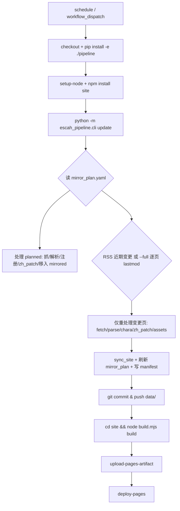

## 用户需求（本轮调整后）

1. **解耦镜像计划配置文件**：新增独立配置文件（默认 `data/registry/mirror_plan.yaml`），包含两个顶层字段：

- `planned`（计划添加页面）：默认为空列表，可填入待镜像的 WIKI 页面名或链接；自动更新任务先检查该字段，若有条目则执行"镜像+翻译"，完成后把该条目移入 `mirrored` 对应分组。
- `mirrored`（已完成镜像）：存放已镜像网页的"网页名 + 链接"，按**原 WIKI 导航分组**组织，子页面按原 WIKI 顺序排列。分组严格采用以下 11 组：
ゲームガイド / キャラクター一覧 / キャラクター一覧SSR / キャラクター一覧SR / キャラクター一覧R / キャラクター一覧サポーター / キャラクター一覧NPC / システム / 装備･アイテム / クエスト･ミッション / その他。

2. **基于"最后编辑时间"的自动更新**：每页 `#body` 内含 `最終更新日時:YYYY-MM-DD (曜) HH:MM:SS`，据此校验变更（多数页多年未改，工作量小）。自动更新封装为 **GitHub Action**：定时运行，新增任务仍走原流程（下载原网页→解析文本→翻译文本→生成镜像页→翻译镜像页做中日切换）。
3. **放弃"首页角色悬停浮窗"计划**：站点已全局应用角色浮窗（CharList/MirrorContent 的 tooltip/popover），无需单独为首页再做，本计划不做任何相关实现。

## 核心功能

- 可维护的镜像清单（planned/mirrored 分组有序），人类可读、机器可驱动。
- 自动更新既能增量（RSS 近期变更）也能全量（逐页 last-edit-time 比对），仅重处理真正变更的页。
- CI 自动抓取→解析→翻译（词典引擎）→构建→部署 GitHub Pages，并把生成的数据层回写仓库。

## 产品概述

超昂大戦 WIKI 中日双语镜像站（VitePress，base `/escah/`）的运维配置与自动化升级：解耦镜像计划清单、用最后编辑时间驱动增量更新、并以 GitHub Action 定时自动镜像+部署。

## 技术栈

- 数据流/流水线：Python 包 `escah_pipeline`（discover/fetch/parse/assets/translate/update/sync-site），层间以文件为契约。
- 真实中文生成：`tools/zh_patch.py`（JA2ZH 词典替换，幂等、确定性、**CI 安全**）。**流水线的 `translate` 不再使用 LLM**——翻译由 AI（人工/词典维护者）通过持续扩展 `zh_patch.py` 的 JA2ZH/GENERIC/REGEX_RULES 词表完成；自动更新与 CI 只确定性地运行 `zh_patch.py`，不再调用 `translator.py` 的 `translate_all`（`translator.py` 的 LLM 路径整体弃用）。
- 站点：VitePress 1.6.3（`site/build.mjs` 编程式 build，写 `.nojekyll`）。
- CI：GitHub Actions（cron + workflow_dispatch）+ GitHub Pages（Actions 制品部署）。

## 实现方案

### 一、镜像计划模块 `pipeline/escah_pipeline/plan.py`（新增）

1. **分组常量与映射**（忠实还原原 WIKI 分组；子页顺序沿用 `pages.yaml` 既有顺序，该顺序本就按 WIKI 抓取顺序生成）：

- `guide` → `ゲームガイド`
- `characters`(slug=characters) → `キャラクター一覧`；`list-ssr/sr/r/supporter/npc` → 对应 `キャラクター一覧SSR/SR/R/サポーター/NPC`；同 `character` 类的参考页（skills/unique-effects/special-attributes/artists/voice-actors/release-history/bedroom-scenes）→ `キャラクター一覧`
- `character-detail` 按 `rarity` 落入 `キャラクター一覧SSR/SR/R/サポーター/NPC`，无 rarity 落入 `キャラクター一覧`
- `system`→`システム`、`equipment`→`装備･アイテム`、`quest`→`クエスト･ミッション`、`misc`→`その他`

2. `parse_wiki_lastmod(html)`：正则 `最終更新日時:(\d{4}-\d{2}-\d{2}) \(.\d?\) (\d{2}:\d{2}:\d{2})` 提取页面最后编辑时间。
3. `fetch_recent_changes(fetcher)`：抓取并解析 `?cmd=rss`（RSS 1.0，`<item><title>页名</title><dc:date>...</dc:date>`），返回近期变更页名集合——避免逐页轮询约 2400 页。
4. `build_mirror_plan(registry, planned)`：从 `pages.yaml` 生成 `mirrored`（按 11 组分组、组内保序），保留传入的 `planned`。
5. `load/save_mirror_plan()`：`data/registry/mirror_plan.yaml` 读写（YAML，`allow_unicode`，`sort_keys=False`）。
6. `MIRROR_PLAN_FILE` 加入 `config.py`。

### 二、CLI `sync-plan`（新增）并接入既有流程

- 新增子命令 `sync-plan`：读取 `pages.yaml` + 现有 `mirror_plan.yaml` 的 `planned`，重建 `mirrored` 并落盘。
- 在 `discover` 与 `update` 末尾各调用一次 `sync_plan()`，保证注册表与计划清单始终同步。
- 本地初始化：跑一次 `python -m escah_pipeline.cli sync-plan`，生成 `mirror_plan.yaml`（`planned: []`，`mirrored` 填满现有 ~2400 页并分组有序）。

### 三、改造 `updater.run_update`（核心）

执行顺序：

1. 读 `mirror_plan.yaml`，取 `planned` 与 `mirrored`。
2. **处理 planned**：对每条（支持字符串页名或 `{name, group?}` 对象）→ 解析页名（去 URL）→ `fetch` → 依 `group`（或默认 `その他`/`character-detail`）注册进 `pages.yaml`（`slug/category/rarity/icon/mode=watch`）→ `parse_all` + `extract_all_characters` → 跑 `zh_patch` → 从 `planned` 移除并写入 `mirrored` 对应组。
3. **变更检测**（二选一）：

- 默认（每日）：`fetch_recent_changes` 取 RSS 近期变更页，仅对其在册页重处理（跳过 `challenged/missing`）。
- `--full`（每周）：遍历所有 `mode=watch` 页，逐页 `parse_wiki_lastmod` 与 manifest 中 `wiki_last_modified` 比对，不同则重处理（礼貌限速，避免误伤仅计数器变动的页）。

4. **重处理变更页**：`fetch`（覆盖快照，记录 `wiki_last_modified`）→ `parse_all(force)` → 视情况 `extract_all_characters` → **`subprocess` 跑 `tools/zh_patch.py`**（唯一翻译路径，词典确定性，无 LLM）。
5. `download_assets()` 补新图 → `sync_site()` → 刷新 `mirror_plan.yaml` → 写 manifest。

### 四、自动更新以本地脚本运行（GitHub Action 已取消）

- **决策**：原定的 GitHub Action 工作流**不配置**。原因：CI 环境内 AI 无法为新增散文补译 `zh_patch.py` 词条，确定性重跑只会沿用旧词表、遗留未译日文；而人工翻译（扩展词表）必须由我在项目对话里完成。因此自动更新保留为**本地命令**，用户需要更新时来对话里让我跑即可。
- 本地运行方式：
- `python -m escah_pipeline.cli update`：默认 RSS 增量（仅重处理近期变更页）。
- `python -m escah_pipeline.cli update --full`：全量逐页比对最后编辑时间。
- `python -m escah_pipeline.cli update --no-translate`：跳过重翻译（仅重抓/重解析）。
- 翻译统一由 `update` 内部以子进程跑 `tools/zh_patch.py` 完成（词典确定性，无 LLM）。
- 站点构建（本地）：`cd site && node build.mjs build` → `site/.vitepress/dist`（含 `.nojekyll`）。
- 部署到 GitHub Pages 仍由人工在本地/手动触发，或日后若全部散文已译完（词表覆盖完整）再考虑补回 CI。

## 实现注意

- `zh_patch.py` 以子进程调用：`subprocess.run([sys.executable, str(ROOT/"tools/zh_patch.py")], cwd=str(ROOT), env={**os.environ, "PYTHONIOENCODING":"utf-8"})`，避免 Windows GBK 编码报错。
- `mirror_plan.yaml` 的 `planned` 在每次 update 后若全部处理完则变回 `[]`；若某页抓取失败则保留以便重试。
- 不要改动 `parser_puki.py` 图片写入与 `MirrorContent.vue` base 重写（前序已修，回归风险高）。
- CI 回写仅提交 `data/`（数据层），站点 `site/.vitepress/*`、`site/<locale>/*`、`site/public/img` 为生成物，每次 CI 由 `sync-site`+`build` 重建，无需入库。
- `pages.yaml` 仍是流水线机器侧真源；`mirror_plan.yaml` 是面向人与自动化的"计划/清单"视图，二者通过 `sync-plan` 保持一致，不重复承担真源职责。

## 架构设计



> **注：上述 CI 部署链路（upload-pages-artifact / deploy-pages / 自动 git push data）已作废。** 实际更新由用户在项目内手动执行：`python -m escah_pipeline.cli update`（或 `--full`）→ `cd site && node build.mjs build` → 手动将 `site/.vitepress/dist` 推送至 gh-pages。GitHub Action 不配置。

## 目录结构

```
pipeline/escah_pipeline/
├── config.py        # [MODIFY] 增加 MIRROR_PLAN_FILE = DATA_DIR/"registry"/"mirror_plan.yaml"
├── cli.py           # [MODIFY] 增加 sync-plan 子命令；discover/update 末尾调用 sync_plan()
├── plan.py          # [NEW] 11 组常量、category/rarity→group 映射、parse_wiki_lastmod、fetch_recent_changes、build/load/save_mirror_plan
├── updater.py       # [MODIFY] planned 处理、RSS/--full last-edit-time 检测、zh_patch 子进程（唯一翻译路径，弃用 LLM）、刷新 plan
└── fetcher.py       # [MODIFY] 复用 PoliteFetcher；recent-changes(RSS) 抓取放入 plan.py
data/registry/
├── pages.yaml        # [MODIFY 由 discover/update 自动维护] 机器侧真源
└── mirror_plan.yaml  # [NEW 由 sync-plan 生成] planned + mirrored(11 组分组有序)
```

## 关键代码结构（plan.py 核心契约）

```python
GROUP_ORDER = [
    "ゲームガイド", "キャラクター一覧", "キャラクター一覧SSR", "キャラクター一覧SR",
    "キャラクター一覧R", "キャラクター一覧サポーター", "キャラクター一覧NPC",
    "システム", "装備･アイテム", "クエスト･ミッション", "その他",
]

# category(+slug/rarity) -> group
def page_group(entry: dict) -> str: ...   # guide->ゲームガイド; character-detail 按 rarity 落入 SSR/SR/R/サポーター/NPC; 其余按 category 映射; 兜底 その他

LASTMOD_RE = re.compile(r"最終更新日時:(\d{4}-\d{2}-\d{2}) \(.\d?\) (\d{2}:\d{2}:\d{2})")
```