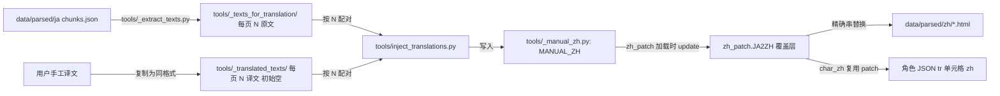

## 用户需求

由于集成的 LLM 翻译效果差，彻底弃用 LLM 翻译方案，重构代码并切换到「用户手动提供翻译文件 → 注入 JA2ZH 词典」的新工作流。

## 产品概述

- 移除所有 LLM 相关脚本与产物（移入 `recycle_bin/`，可恢复，不永久删除）。
- 保留并切换核心翻译引擎（`zh_patch.py` 词典替换 + `char_zh.py`）为纯手工译文驱动。
- 新建 `tools/_translated_texts/` 翻译结果工作目录，其结构与 `tools/_texts_for_translation/` 完全一致（顶层页面 `.txt` + `characters/` 下 369 个角色 `.txt`），文件初始留空，等待用户按相同 `[N] 译文` 格式填入。
- 编写 `tools/inject_translations.py`，按 `[N]` 索引把待译文件的日文与已译文件的中文配对，写入独立手工覆盖表，注入后由 `zh_patch.py` 优先采用，使全站页面与角色 JSON 同步生效。
- 清理 TODO.md / MEMORY.md 中 LLM 相关待办与方案描述，记录新手动工作流。

## 核心功能

- 按约定将 LLM 代码/产物回收至 `recycle_bin/`，并校验活跃代码无 `import` 残留。
- 生成 `tools/_translated_texts/` 空文件骨架（镜像 `_texts_for_translation/` 树）。
- `inject_translations.py`：按页 + `[N]` 配对 `(ja, zh)`，非空译文写入 `tools/_manual_zh.py` 的 `MANUAL_ZH` 覆盖表，幂等、带计数与 `--force` 覆盖。
- `zh_patch.py` 加载时合并 `MANUAL_ZH` 到 `JA2ZH` 之上（手工译文优先），不改变原有 2.7 万条字面量。
- 同步修订 `.gitignore`、TODO.md、MEMORY.md 与当日记忆。

## 技术栈选择

- 语言/运行：Python 3（沿用 `tools/` 现有脚本，无新依赖，仅用标准库 `pathlib`/`re`/`argparse`/`json`）。
- 复用现有引擎：`zh_patch.py`（JA2ZH 精确串替换引擎）、`char_zh.py`（角色 JSON 单元格补 zh），二者共用 JA2ZH 词典，注入后即同步生效。
- 中性工具保留：`tools/_extract_texts.py`（从 `data/parsed/ja/**/*.chunks.json` 生成 `_texts_for_translation/`）作为新工作流的源文件生成器。

## 实现方案

整体采用「源文件（`_texts_for_translation`）提供日文锚点 + 结果文件（`_translated_texts`）提供中文 + 注入脚本配对写覆盖表」的纯本地手工工作流，不引入任何网络/LLM 调用。

关键技术决策：

1. **不重写 `zh_patch.py` 内 2.7 万条 `JA2ZH` 字面量**，而是新增独立覆盖文件 `tools/_manual_zh.py` 的 `MANUAL_ZH: dict[str,str]`（ja→zh），在 `zh_patch.py` 加载完自身词典后执行 `JA2ZH.update(MANUAL_ZH)`，保证手工译文优先且可追溯、可整体移除。理由：直接改写巨型字面量表会破坏可读性与历史，且难以回滚。
2. **按 `[N]` 索引配对而非按文本**：`_texts_for_translation/<slug>.txt` 与 `_translated_texts/<slug>.txt` 行格式均为 `[N] 文本`，N 同源 `chunks.json` 顺序。注入时同一 slug 下逐行解析 `[N]`，用 N 把 ja 与 zh 对齐，避免跨文件文本匹配歧义。
3. **空文件骨架**：`inject_translations.py` 创建前，先用脚本扫描 `_texts_for_translation/` 树，在相同相对路径写出 0 字节文件到 `_translated_texts/`，保证命名（含日文角色名）与结构完全镜像。

性能与可靠性：注入为 O(总条数) 线性扫描，量极小（数千条），无性能瓶颈；幂等（重跑仅重写同一 `MANUAL_ZH`，内容零差异）；已存在的 ja key 默认跳过并计数，`--force` 显式覆盖；配对长度不一致时仅处理到较短者并告警。

## 实现注意事项

- **接地**：覆盖表合并点（`JA2ZH.update`）须放在 `zh_patch.py` 自身 `JA2ZH = {...}` 字面量定义之后、首次使用之前；执行时先读 `zh_patch.py` 确认该字典的定义形态与加载顺序，避免破坏确定性替换语义。
- **防回归**：移动 LLM 文件前，用 `grep` 确认 `pipeline/`（updater/sitegen/parser_puki/cli）及 `tools/` 活跃脚本无任何 `import _api_pipeline / import comment_translate / from openai` 残留（CLI 的 `translate` 命令走 `_run_zh_patch` 的「无 LLM」路径，不受影响）。
- **向后兼容**：`comment_zh.py`（评论 applier）保留待用，其输入 `comment_zh.json` 后续亦可走手工渠道，本次不改动。
- **blast radius**：仅新增/移动 `tools/` 文件与改 `.gitignore`/文档；不触碰 `data/parsed`、`site/`、流水线核心逻辑。

## 架构设计



## 目录结构

```
escah/
├── recycle_bin/tools/              # [MOVE] LLM 相关脚本与产物（可恢复，非永久删除）
│   ├── _api_pipeline.py            # 主 LLM 管线（import openai）
│   ├── _cmt_call.py                # 评论 LLM 调用（import openai + _api_pipeline）
│   ├── comment_translate.py        # 评论 LLM 翻译（import _api_pipeline）
│   ├── _translate_loop.py          # LLM 翻译循环
│   ├── _t_diag.py                  # LLM 翻译诊断
│   ├── _export_for_api.py          # API 批次导出
│   ├── _split_for_api.py           # API 批次拆分
│   ├── _export_untranslated.py     # 未译导出
│   ├── _split_untranslated.py      # 未译拆分
│   ├── _llm_translations.json      # LLM 译文产物（若存在）
│   ├── _api_batches/ _api_results/ _untranslated/   # 工作目录
│   └── _for_api.txt _untranslated.txt _cmt_translate.err _rejected.json
├── tools/
│   ├── _texts_for_translation/     # [KEEP] 用户已放置的待译源（日文锚点，[N] 格式）
│   ├── _translated_texts/          # [NEW] 镜像空文件骨架：顶层 .txt + characters/369 个，初始 0 字节，等用户填 [N] 译文
│   ├── _manual_zh.py               # [NEW] MANUAL_ZH: dict[str,str]，由注入脚本生成，ja→手工 zh（优先于 JA2ZH）
│   ├── inject_translations.py      # [NEW] 按 slug + [N] 配对 src(ja)/dst(zh)，写 MANUAL_ZH；幂等、计数、--force
│   ├── zh_patch.py                 # [MODIFY] 加载末尾合并 MANUAL_ZH 到 JA2ZH（手工优先）
│   ├── char_zh.py                  # [KEEP] 复用 zh_patch.patch()，随 JA2ZH 增长受益
│   ├── comment_zh.py               # [KEEP] 评论译文 applier（待用）
│   └── _extract_texts.py           # [KEEP] 源文件生成器
├── .gitignore                      # [MODIFY] 删除 _api_batches/_api_results/_for_api.txt/_untranslated* 死条目；新增忽略 _texts_for_translation/ 与 _translated_texts/
├── TODO.md                         # [MODIFY] 标注 LLM 方案弃用，P1/P2 改为手动工作流，新增「手动翻译工作流」小节
├── .codebuddy/memory/MEMORY.md     # [MODIFY] 翻译方案决策改为「已弃用 LLM，改手动注入 JA2ZH」；LLM 管线小节注已删除
└── .codebuddy/memory/2026-07-26.md # [NEW] 记录本次重构与手动工作流约定
```

## 关键代码结构

```python
# tools/_manual_zh.py  （由 inject_translations.py 自动生成/更新）
MANUAL_ZH: dict[str, str] = {
    # ja -> 手工 zh 译文，注入时优先于 zh_patch.JA2ZH
}
```

```python
# tools/inject_translations.py
def inject_page(src: Path, dst: Path, manual: dict[str, str], *, force: bool = False) -> tuple[int, int]:
    """按 [N] 配对 src(ja) 与 dst(zh)，将非空 zh 写入 manual；返回 (新增, 跳过)。"""
```